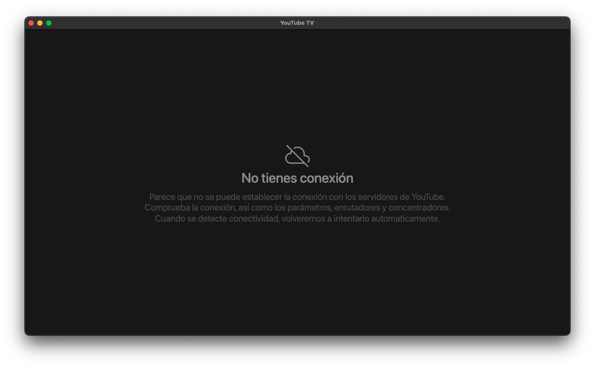

<div align="center">


# **YouTube TV**
[](https://github.com/marcosrg9/YouTubeTV/releases/)
[](https://github.com/marcosrg9/YouTubeTV/releases/tag/v2.3.4)

Cliente de YouTube TV sencillo para escritorio basado en [electron](https://www.electronjs.org/). Puede conectar un dispositivo compatible, como un teléfono o un equipo con Google Chrome y enviar los vídeos a la aplicación para visualizarlos.


</div><br>

## 🌎 Idiomas

Este readme está disponible en los siguientes idiomas:

- 🇺🇸 [Inglés](./README.md)
- 🇪🇸 Español

Implementa un servidor [DIAL](https://en.wikipedia.org/wiki/Discovery_and_Launch) (basado en [SSDP](https://en.wikipedia.org/wiki/Simple_Service_Discovery_Protocol)) para permitir la conexión desde dispositivos que usan este mismo protocolo (limitado a YouTube en esta aplicación).

Usa el userAgent permitido por YouTube TV:
```
Mozilla/5.0 (X11; Linux i686) AppleWebKit/534.24 (KHTML, like Gecko) Chrome/11.0.696.77 Large Screen Safari/534.24 GoogleTV/092754
```

Puede usar ```npm start``` o bien ```npx electron .```.
Si ya tiene instalado electron de forma global, podrá iniciar la app con ```electron .```


## 📦 Builds
El proyecto se puede descargar compilado y listo para su uso. Disponible para Linux, macOS y Windows. En arquitecturas x86, x64 y ARM.

**⚠️ Nota: La arquitectura de 32 bits ya no es soportada para Linux, y se planea eliminar el soporte para Windows en el futuro.**

| Platform      |   Architecture   |  Link  |
|---------------|:----------------:|:------:|
| Windows       | x32/x64          | [Descargar](https://github.com/marcosrg9/YouTubeTV/releases/download/v2.3.4/YouTube.TV-2.3.4.exe) |
| Linux (Deb)   | x64              | [Descargar](https://github.com/marcosrg9/YouTubeTV/releases/download/v2.3.4/YouTube.TV-2.3.4-amd64.deb) |
| Linux (Deb)   | ARM64            | [Descargar](https://github.com/marcosrg9/YouTubeTV/releases/download/v2.3.4/YouTube.TV-2.3.4-arm64.deb) |
| Linux (Deb)   | ARMv7l           | [Descargar](https://github.com/marcosrg9/YouTubeTV/releases/download/v2.3.4/YouTube.TV-2.3.4-armv7l.deb) |
| Linux (RPM)   | x64              | [Descargar](https://github.com/marcosrg9/YouTubeTV/releases/download/v2.3.4/YouTube.TV-2.3.4-x86_64.rpm) |
| Linux (RPM)   | ARMv7l           | [Descargar](https://github.com/marcosrg9/YouTubeTV/releases/download/v2.3.4/YouTube.TV-2.3.4-armv7l.rpm) |
| Linux (RPM)   | ARM64            | [Descargar](https://github.com/marcosrg9/YouTubeTV/releases/download/v2.3.4/YouTube.TV-2.3.4-aarch64.rpm) |
| macOS         | Intel (x64)      | [Descargar](https://github.com/marcosrg9/YouTubeTV/releases/download/v2.3.4/YouTube.TV-2.3.4.dmg) |
| macOs         | Apple Chip (ARM) | [Descargar](https://github.com/marcosrg9/YouTubeTV/releases/download/v2.3.4/YouTube.TV-2.3.4-arm64.dmg) |

[Todas las builds](https://github.com/marcosrg9/YouTubeTV/releases/latest)

## ⌨️ Atajos de teclado
- Panel de configuración de resolución máxima: <kbd>Ctrl</kbd> + <kbd>S</kbd>
- Pantalla completa: <kbd>Ctrl</kbd> + <kbd>F</kbd>.
- Developer Tools: <kbd>Ctrl</kbd> + <kbd>D</kbd>.
- Alternar visibilidad del cursor: <kbd>Ctrl</kbd> + <kbd>A</kbd>.


No comprobado en Windows y macOS para plataformas ARM, excepto linux ARM para Raspberry (armv7l). 

## 🔌 Mensaje fuera de conexión – [Última actualización – 2.3.4] 

Cuando YouTube TV carga sin conexión, mostrará un mensaje indicando que no es posible conectarse con los servidores de YouTube.

Cuando el renderizador detecte conectividad, lo volverá a intentar nuevamente.


## 🔧 Configuración

YouTube TV incluye ahora una ventana para configurar la resolución máxima de reproducción.

Esta ventana se abre pulsando las teclas <kbd>Ctrl</kbd> + <kbd>S</kbd>.
<div align="center">

</div>
La resolución ha sido limitada desde el entorno de desarrollo por la siguiente razón:

Hoy en día la mayoría de equipos disponen de gráficas integradas, esto quiere decir que comparten memoria con el resto del sistema, a diferencia de las gráficas discretas que incluyen sus propios módulos de memoria donde tienen un espacio aislado de almacenamiento sin carga externa.

Esto implica más carga de trabajo para el procesador, y hay casos en los que resoluciones superiores a 2K/4K empiezan a afectar al rendimiento de forma exagerada.

Evidentemente el usuario final puede establecer la resolución que desee, sin embargo, YouTube es capaz de medir el ancho de banda y establecer automáticamente la mejor resolución disponible en relación al ancho de banda, lo cual se puede volver molesto, pues muchas veces la potencia del hardware no es suficiente para reproducir resoluciones tan altas.