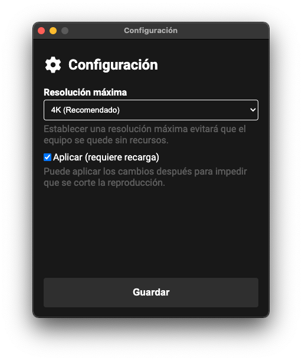

<div align="center">


# **YouTube TV**
[](https://github.com/marcosrg9/YouTubeTV/releases/)
[](https://github.com/marcosrg9/YouTubeTV/releases/2.2.1)

Cliente de YouTube TV sencillo para escritorio basado en [electron](https://www.electronjs.org/). Puede conectar un dispositivo compatible, como un teléfono o un equipo con Google Chrome y enviar los vídeos a la aplicación para visualizarlos.


</div><br>

## 🌎 Idiomas

Este readme está disponible en los siguientes idiomas:

- 🇺🇸 [Inglés](./README.md) ([alealclag](https://github.com/alealclag))
- 🇪🇸 Español (marcosrg9)

Implementa un servidor [DIAL](https://en.wikipedia.org/wiki/Discovery_and_Launch) (basado en [SSDP](https://en.wikipedia.org/wiki/Simple_Service_Discovery_Protocol)) para permitir la conexión desde dispositivos que usan este mismo protocolo (limitado a YouTube en esta aplicación).

Usa el userAgent permitido por YouTube TV:
```
Mozilla/5.0 (X11; Linux i686) AppleWebKit/534.24 (KHTML, like Gecko) Chrome/11.0.696.77 Large Screen Safari/534.24 GoogleTV/092754
```

Puede usar ```npm start``` o bien ```npx electron .```.
Si ya tiene instalado electron de forma global, podrá iniciar la app con ```electron .```


## 📦 Builds
El proyecto se puede descargar compilado y listo para su uso. Disponible para Linux, macOS y Windows. En arquitecturas x86, x64 y ARM.

| Plataforma    | Arquitectura | Enlace |
|---------------|:------------:|:------:|
| Windows       | x64          | [](https://github.com/marcosrg9/YouTubeTV/releases/download/2.2.1/YouTube.TV-win32-x64.exe) |
| Windows       | x32          | [](https://github.com/marcosrg9/YouTubeTV/releases/download/2.2.1/YouTube.TV-win32-x86.exe) |
| Linux (Deb)   | x64          | [](https://github.com/marcosrg9/YouTubeTV/releases/download/2.2.1/YouTube.TV-linux-x64.deb) |
| Linux (Deb)   | x32          | [](https://github.com/marcosrg9/YouTubeTV/releases/download/2.2.1/YouTube.TV-linux-x32.deb) |
| Linux (Deb)   | ARM          | [](https://github.com/marcosrg9/YouTubeTV/releases/download/2.2.1/YouTube.TV-linux-armv7l.deb) |
| Linux (RPM)   | x64          | [](https://github.com/marcosrg9/YouTubeTV/releases/download/2.2.1/YouTube.TV-linux-x64.rpm) |
| Linux (RPM)   | x32          | [](https://github.com/marcosrg9/YouTubeTV/releases/download/2.2.1/YouTube.TV-linux-x32.rpm) |
| Linux (RPM)   | ARM          | [](https://github.com/marcosrg9/YouTubeTV/releases/download/2.2.1/YouTube.TV-linux-armv7l.rpm) |
| macOS         | x64          | [](https://github.com/marcosrg9/YouTubeTV/releases/download/2.2.1/YouTube.TV-2.2.1-x64.dmg) |
| macOs         | ARM          | [](https://github.com/marcosrg9/YouTubeTV/releases/download/2.2.1/YouTube.TV-2.2.1-arm64.dmg) |

[Todas las builds](https://github.com/marcosrg9/YouTubeTV/releases/tag/2.2.1)

## ⌨️ Atajos de teclado
- 🆕 Panel de configuración de resolución máxima: <kbd>Ctrl</kbd> + <kbd>S</kbd>
- Pantalla completa: <kbd>Ctrl</kbd> + <kbd>F</kbd>.
- Developer Tools: <kbd>Ctrl</kbd> + <kbd>D</kbd>.
- Alternar visibilidad del cursor: <kbd>Ctrl</kbd> + <kbd>A</kbd>.


## 🔄 Última actualización (2.2.1)

La última actualización incluye varias mejoras:

- Soporte para resoluciones hasta 8K. ([Limitado a 4K por defecto](#🔧-configuración))
- Soporte de reproducción en segundo plano.
- Mejoras de UX.
- Servidor resistente a puertos en uso.
- Parches de seguridad.

## Informe detallado
---

- Se ha implementado un sistema de simulación de resolución. Ahora YouTube TV puede simular una resolución superior a la de la pantalla para que la plataforma no restrinja las resoluciones máximas a las truncadas. La resolución está limitada a 4K de forma predeterminada, revisa la [sección de configuración](#🔧-configuración).

- Se ha solucionado un fallo grave por el cual el servidor no podía iniciarse cuando el puerto estaba en uso. Ahora intentará iniciarse en el puerto por defecto (2000), y si este ya está en uso, volverá a intentarlo tantas veces como sea necesario con puertos aleatorios.

- Ahora YouTube TV entra en modo pantalla completa de forma automática cuando se conecta un dispositivo y sale de ella cuando se desconecta.

- YouTube TV ya es capaz de reproducir contenido en segundo plano incluso perdiendo el foco. Esto estaba siendo provocado por un evento de cambio de visiblidad que escuchaba la propia plataforma. Este evento ha sido anulado.

- Electron actualizado a la versión 13.2.1.

- Fallos de seguridad corregidos
    - [CVE-2021-23343](https://github.com/advisories/GHSA-hj48-42vr-x3v9)
    - [CVE-2021-33502](https://github.com/advisories/GHSA-px4h-xg32-q955)
    - [CVE-2021-33623](https://github.com/advisories/GHSA-7p7h-4mm5-852v)
    - [CVE-2021-23362](https://github.com/advisories/GHSA-43f8-2h32-f4cj)
    - [CVE-2021-23337](https://github.com/advisories/GHSA-35jh-r3h4-6jhm)


## ⛔ Problemas conocidos

- Si se genera una cola y después otro usuario se conecta (echa al que ya estaba conectado), la cola se elimina. Este no es el comportamiento esperado, pero es algo inevitable, parece ser el funcionamiento normal de la plataforma YouTube TV.

## ⚙️ Tests

- ✅ Windows 10 x64 - win32_x64/ia32.
- ✅ Ubuntu 19.04 x64 (VM) - linux_x64.
- ✅ macOS 11.4 Big Sur (MacBook Air) - darwin_x64 (Marcos).
- ✅ macOS 11.2.3 Big Sur (MacBook Air) - darwin_x64 (Marcos).
- ✅ macOS 11.1 Big Sur (MacBook Air) - darwin_x64 ([Mateo Fortea](https://github.com/mfortea)).
- ✅ Rasbian 10 Buster (Raspberry Pi 4 B+) - linux_armv7l.

No comprobado en Windows y macOS para plataformas ARM, excepto linux ARM para Raspberry (armv7l). 

## 🔧 Configuración

YouTube TV incluye ahora una ventana para configurar la resolución máxima de reproducción.

Esta ventana se abre pulsando las teclas <kbd>Ctrl</kbd> + <kbd>S</kbd>.
<div align="center">

</div>
La resolución ha sido limitada desde el entorno de desarrollo por la siguiente razón:

Hoy en día la mayoría de equipos disponen de gráficas integradas, esto quiere decir que comparten memoria con el resto del sistema, a diferencia de las gráficas discretas que incluyen sus propios módulos de memoria donde tienen un espacio aislado de almacenamiento sin carga externa.

Esto implica más carga de trabajo para el procesador, y hay casos en los que resoluciones superiores a 2K/4K empiezan a afectar al rendimiento de forma exagerada.

Evidentemente el usuario final puede establecer la resolución que desee, sin embargo, YouTube es capaz de medir el ancho de banda y establecer automáticamente la mejor resolución disponible en relación al ancho de banda, lo cual se puede volver molesto, pues muchas veces la potencia del hardware no es suficiente para reproducir resoluciones tan altas.

<center>

**Licencia Creative Commons**


</center>