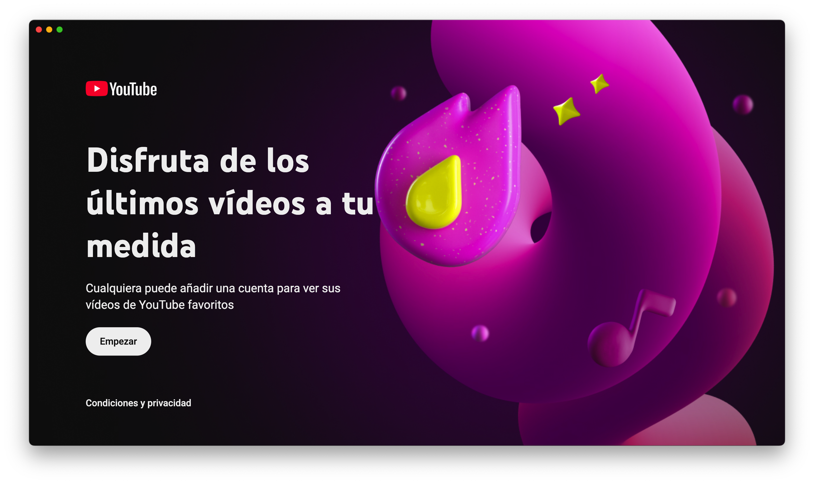
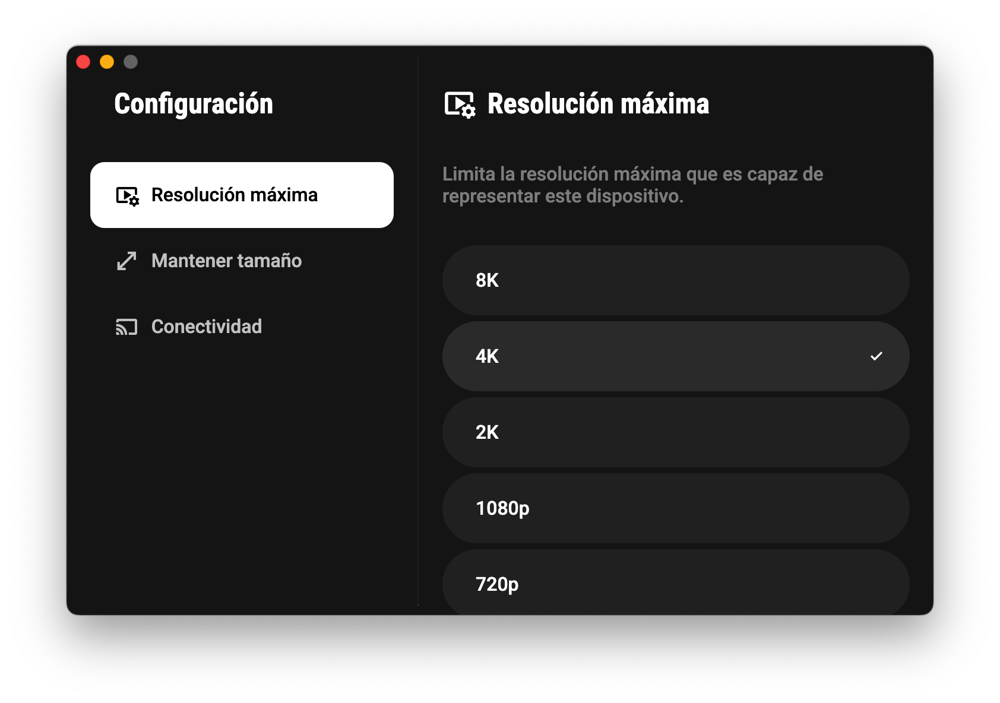
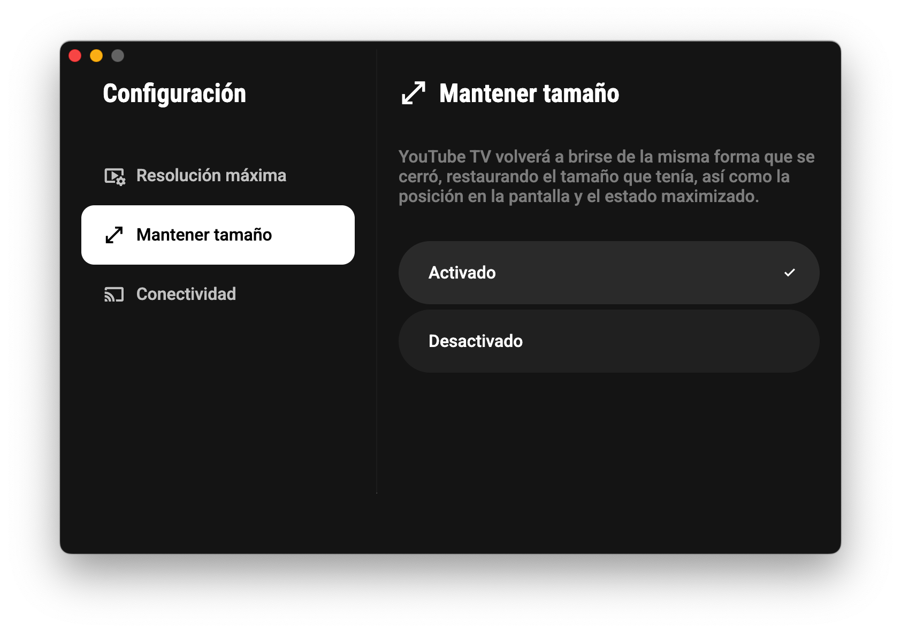
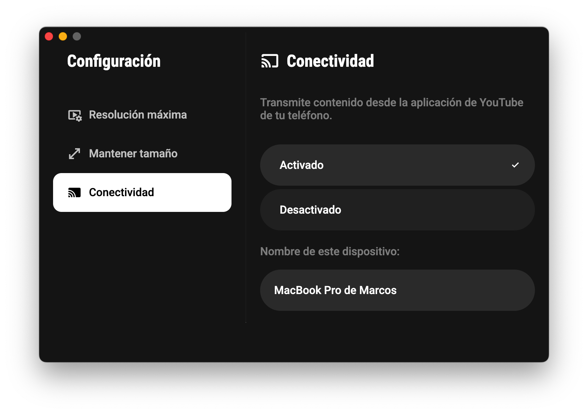

# **YouTube TV**

YouTube TV es una aplicación que lleva la versión de YouTube para televisores a los escritorios, igual que Chromecast o un televisor inteligente.

 

## 🌎 Idiomas

Este readme está disponible en los siguientes idiomas:

- 🇪🇸 Español
- 🇺🇸 [Inglés](./README.md)

## 📦 Descargas

YouTube TV está disponible para Linux, Windows y macOS. Puede encontrar binarios precompilados para la mayoría de plataformas. Si su plataforma es linux sobre arm, consulte la cita que se encuentra después de la lista de descargas.

<table width="100px">
    <tr>
        <th>Platform</th>
        <th>Architecture</th>
        <th>Link</th>
    </tr>
    <tr>
        <td rowspan="2">Windows</td>
        <td>x64/ARM64</td>
        <td align="center">
        
        </td>
    </tr>
    <tr>
        <td>ARM</td>
        <td align="center">
            
        </td>
    </tr>
    <tr>
        <td rowspan="2">macOS</td>
        <td>x64</td>
        <td align="center">
            
        </td>
    </tr>
    <tr>
        <td>Apple Silicon (ARM)</td>
        <td align="center">
            
        </td>
    </tr>
    <tr>
        <td rowspan="1">Linux (Debian)</td>
        <td>x64</td>
        <td align="center">
            
        </td>
    </tr>
    <tr>
        <td rowspan="1">Linux (RedHat)</td>
        <td>x64</td>
        <td align="center">
            
        </td>
    </tr>
</table>

[Todas las builds](https://github.com/marcosrg9/YouTubeTV/releases/latest)

> [!NOTE]
> 1. Las versiones de 32 bits se han dejado de distribuir.
>
> 2. **No hay soporte para ARM en Linux**, puede obtener más información en los siguientes lugares:
>       - [Sitio web de Chromium](https://issues.chromium.org/issues/438403374)
>       - [Castlabs Issue GitHub #198](https://github.com/castlabs/electron-releases/issues/198)
>       - [Castlabs Issue GitHub #146 (RPi)](https://github.com/castlabs/electron-releases/issues/146)
>
>       Estaré atento en cada build para comprobar el estado del soporte.

## ⌨️ Atajos de teclado

- **Ventana de configuración**: <kbd>Ctrl</kbd> + <kbd>S</kbd>
- **Pantalla completa**: <kbd>Ctrl</kbd> + <kbd>F</kbd>.
- **Alternar visibilidad** del cursor: <kbd>Ctrl</kbd> + <kbd>A</kbd>.

**Para desarrolladores**:
- **DevTools de la ventana principal**: <kbd>Ctrl</kbd> + <kbd>D</kbd>.
- **DevTools de la ventana de configuración**: <kbd>Ctrl</kbd> + <kbd>⇧ Shift</kbd> + <kbd>D</kbd>.
- **Mostrar opciones ocultas**: 

## 🔧 Configuración

YouTube TV incorpora una serie de preferencias que puedes ajustar a tu gusto.\
Para abrir esta ventana, pulsa la combinación de teclas <kbd>Ctrl</kbd> + <kbd>S</kbd>.
> [!NOTE]
> Puedes moverte por la configuración usando las flechas de teclado, igual que en la ventana principal.
> - <kbd>↑</kbd>: Mover a la opción superior.
> - <kbd>↓</kbd>: Mover a la opción inferior.
> - <kbd>←</kbd>: Volver a la barra lateral.
> - <kbd>→</kbd>: Mover a la primera opción de la sección actual.
>   

### Resolución máxima:

Establecer una resolución máxima puede beneficiar al dispositivo si este no tiene un hardware con la capacidad suficiente para representar vídeo de alta calidad pero YouTube determina que en, base a la velocidad de la red, puede reproducir una alta resolución.\
Puede ser útil para dispositivos como una Raspberry Pi.

> **Nota**: a partir de la versión 3.0.0, esta configuración parece no estar teniendo un comportamiento esperado. Cuando esta opción se implemetó, en realidad fue para "engañar" a YouTube haciéndole creer que el dispositivo tenía una capacidad de resolución mayor para poder visualizar contenido a mayor calidad, luego esta opción se añadió como una configuración de limitación adicional. Sin embargo, en la versión 3.0.0 se realizaron cambios que puede haber afectado a cómo YouTube determina esta capacidad, de forma que siempre se obtienen resoluciones de vídeo de hasta 4K.

### Mantener tamaño:

YouTube TV puede recordar la ubicación de la ventana y el estado de pantalla completa.
Sin embargo sería posible que esta configuración, de forma predeterminada, resultara incómoda para ciertos usuarios, por lo que ahora se permite activarlo o desactivarlo.

### Transmitir

YouTube TV permite usar tu teléfono para enviar contenido usando la aplicación de YouTube. Funciona exactamente igual que YouTube en un Chromecast o un televisor inteligente con la aplicación YouTube.\
Consulta la guía de Google para obtener [más información](https://support.google.com/chromecast/answer/2995235?hl=es).

Esta opción está activada por defecto, sin embargo puedes desactivarla si lo crees necesario.

Además, puedes añadir un nombre personalizado para reconocer tu equipo más facilmente cuando quieras enviar contenido.

<!-- ### Segundo plano [no implementado]

YouTube TV puede mantenerse en segundo plano a la espera de que algún dispositivo se conecte para transmitir contenido.

Cuando esta opción esté activada, YouTube TV se mantendrá en un estado de pausa hasta que algún teléfono se conecte a él.

> **Nota**: esta opción requiere que el servicio de conectividad esté activado, en caso contrario no funcionará. -->

## ⚡️ Registro de cambios
### Parche (3.0.1)
- Se ha solucionado un fallo en la persistencia, la cual impedía inicializar la configuración.
- Se ha corregido el empaquetado de la aplicación para solucionar un fallo que impedía instalar YouTube TV en Windows ([#64](https://github.com/marcosrg9/YouTubeTV/issues/64)).
- Se ha corregido la categoría de la aplicación en sistemas Linux.
### 3.0.0
- Se ha logrado integrar un sistema DRM. [Más información](/castlabs)
- Finalmente se puede lograr visualizar contenido hasta en 4K, aunque existe una opción para 8K, no parece funcionar adecuadamente.
- Se ha rediseñado por completo la configuración.
- Se ha añadido un pequeño sistema de alertas para versiones más nuevas.
- Se ha implementado un sistema de internacionalización. Ahora es posible añadir nuevos idiomas facilmente.
- Ahora es posible definir un nombre de dispositivo personalizado para transmitir contenido desde un teléfono.
- Se ha actualizado dependencias.

## Deuda técnica
- El renderizador de configuración se ha reelaborado muy rápido sin tener en cuenta la estructura que podría implementarse en un futuro, por lo que añadir nuevas secciones va a ser muy complejo, se deja pendiente de refactorización.

## ⚠️ Nota sobre el bloqueo de anuncios
He recibido en algunas ocasiones propuestas para añadir un bloqueador de anuncios.\
Cuando empecé a desarrollar esta aplicación, mi intención fue usarla en una Raspberry Pi, únicamente por disfrute personal, sin embargo iba añadiendo los cambios a GitHub, principalmente para tener algo más en mi portfolio de cara a mi perfil profesional, además de compartir algo con el mundo.

El objetivo de esta aplicación es **que la experiencia de usuario sea lo más fiel posible a una solución que podría ser desarrollada por Google**.\
En la versión 3.0.0 se ha implementado un bloqueador de anuncios, únicamente para poder hacer las decenas de pruebas que tuve que realizar sin tener que esperar a que los anuncios terminen, pero lo he desactivado en las compilaciones públicas y solo está disponible en entorno de desarrollo. Cualquier desarrollador que quiera hacer aportaciones encontrará la forma de activarlo.

Comprendo la incomodidad de los anuncios, soy el primero en afirmarlo y soy consciente de ello, pero no es el objetivo de esta aplicación. Por lo tanto, a partir de ahora rechazaré todas las PR y cerraré las propuestas que impliquen bloquear anuncios.
