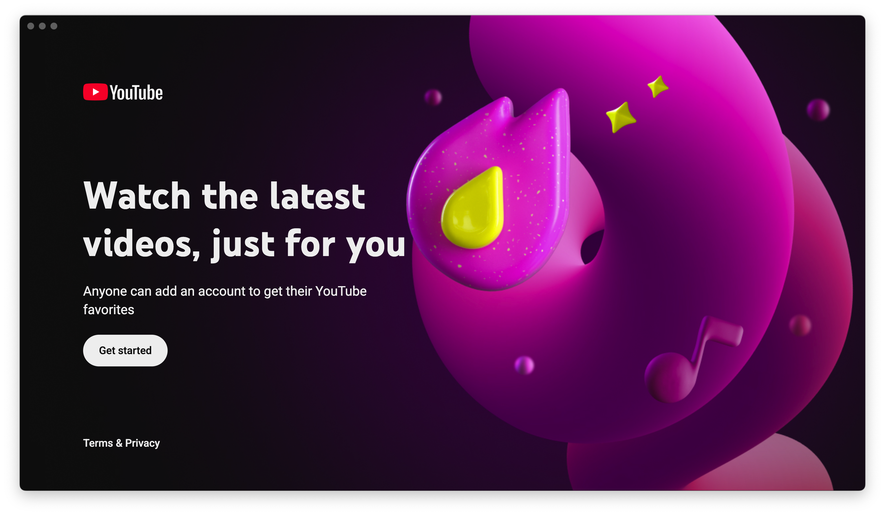

# **YouTube TV**

YouTube TV is an application that brings the TV version of YouTube to the desktop, acting just like a Chromecast or a Smart TV.

 

## 🌎 Languages

This readme is available in the following languages:

- 🇪🇸 [Spanish](./README.es-ES.md)
- 🇺🇸 English

## 📦 Downloads

YouTube TV is available for Linux, Windows, and macOS. You can find precompiled binaries for most platforms. If your platform is Linux on ARM, please refer to the note found after the download list.

<table width="100px">
    <tr>
        <th>Platform</th>
        <th>Architecture</th>
        <th>Link</th>
    </tr>
    <tr>
        <td rowspan="2">Windows</td>
        <td>x64</td>
        <td align="center">
        
        </td>
    </tr>
    <tr>
        <td>ARM</td>
        <td align="center">
            
        </td>
    </tr>
    <tr>
        <td rowspan="2">macOS</td>
        <td>x64</td>
        <td align="center">
            
        </td>
    </tr>
    <tr>
        <td>Apple Silicon (ARM)</td>
        <td align="center">
            
        </td>
    </tr>
    <tr>
        <td rowspan="1">Linux (Debian)</td>
        <td>x64</td>
        <td align="center">
            
        </td>
    </tr>
    <tr>
        <td rowspan="1">Linux (RedHat)</td>
        <td>x64</td>
        <td align="center">
            
        </td>
    </tr>
    </table>

[All builds](https://github.com/marcosrg9/YouTubeTV/releases/latest)

> [!NOTE]
> 1. 32-bit versions are no longer distributed.
>
> 2. **There is no support for ARM on Linux**. You can find more information at the following locations:
>       - [Chromium Website](https://issues.chromium.org/issues/438403374)
>       - [Castlabs Issue GitHub #198](https://github.com/castlabs/electron-releases/issues/198)
>       - [Castlabs Issue GitHub #146 (RPi)](https://github.com/castlabs/electron-releases/issues/146)
>
>       I will monitor the status with every build to check for support updates.

## ⌨️ Keyboard Shortcuts

- **Settings Window**: <kbd>Ctrl</kbd> + <kbd>S</kbd>
- **Full Screen**: <kbd>Ctrl</kbd> + <kbd>F</kbd>.
- **Toggle Cursor Visibility**: <kbd>Ctrl</kbd> + <kbd>A</kbd>.

**For Developers**:
- **Main Window DevTools**: <kbd>Ctrl</kbd> + <kbd>D</kbd>.
- **Settings Window DevTools**: <kbd>Ctrl</kbd> + <kbd>⇧ Shift</kbd> + <kbd>D</kbd>.
- **Show Hidden Options**: 

## 🔧 Configuration

YouTube TV includes a set of preferences that you can adjust to your liking.\
To open this window, press <kbd>Ctrl</kbd> + <kbd>S</kbd>.
> [!NOTE]
> You can navigate the settings using the arrow keys, just like in the main window.
> - <kbd>↑</kbd>: Move to the option above.
> - <kbd>↓</kbd>: Move to the option below.
> - <kbd>←</kbd>: Return to the sidebar.
> - <kbd>→</kbd>: Move to the first option of the current section.
>   

### Max Resolution:

Setting a maximum resolution can benefit the device if it lacks the hardware capability to render high-quality video, but YouTube determines that it can play at a high resolution based on network speed.\
This can be useful for devices like a Raspberry Pi.

> **Note**: As of version 3.0.0, this setting does not seem to behave as expected. When this option was implemented, it was actually intended to "trick" YouTube into believing the device had a higher resolution capability to view higher quality content; later, this option was added as an additional limiting setting. However, changes made in version 3.0.0 may have affected how YouTube determines this capability, resulting in video resolutions of up to 4K being obtained regardless.

### Keep Size:

YouTube TV can remember the window location and full-screen state.
However, this default configuration might be uncomfortable for some users, so it can now be toggled on or off.

### Casting

YouTube TV allows you to use your phone to send content using the YouTube app. It works exactly like YouTube on a Chromecast or a Smart TV with the YouTube app installed.\
Check the Google guide for [more information](https://support.google.com/chromecast/answer/2995235?hl=es).

This option is enabled by default, but you can disable it if necessary.

Additionally, you can add a custom name to recognize your device more easily when you want to cast content.

## ⚡️ Changelog (3.0.0)
- Successfully integrated a DRM system. [More info](/castlabs)
- Content can finally be viewed up to 4K. Although an option for 8K exists, it does not seem to work properly.
- The settings interface has been completely redesigned.
- A small alert system for newer versions has been added.
- An internationalization system has been implemented. It is now easy to add new languages.
- It is now possible to define a custom device name for casting content from a phone.
- Dependencies have been updated.

## Technical Debt
- The settings renderer was reworked very quickly without considering the structure that might be implemented in the future. Therefore, adding new sections will be very complex. This is pending refactoring.

## ⚠️ Note on Ad Blocking
I have occasionally received proposals to add an ad blocker.\
When I started developing this application, my intention was to use it on a Raspberry Pi solely for personal enjoyment. However, I kept pushing changes to GitHub, mainly to have something else in my portfolio for my professional profile, in addition to sharing something with the world.

The goal of this application is **for the user experience to be as faithful as possible to a solution that could be developed by Google**.\
In version 3.0.0, an ad blocker was implemented solely to perform the dozens of tests I had to run without waiting for ads to finish, but I have disabled it in public builds, and it is only available in the development environment. Any developer who wishes to contribute will find a way to activate it.

I understand the annoyance of ads—I am the first to say so and I am aware of it—but blocking them is not the purpose of this application. Therefore, from now on, I will reject all PRs and close proposals that involve ad blocking.